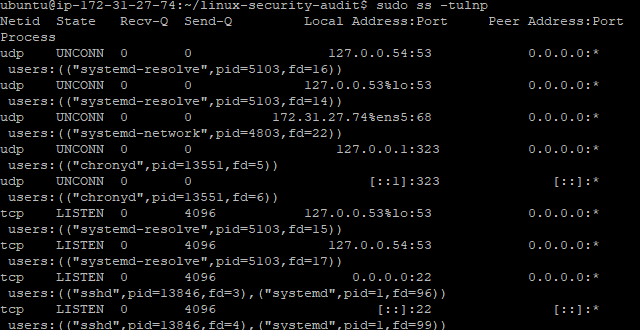
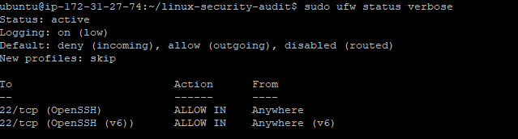
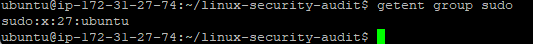
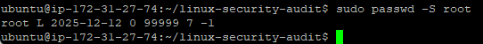
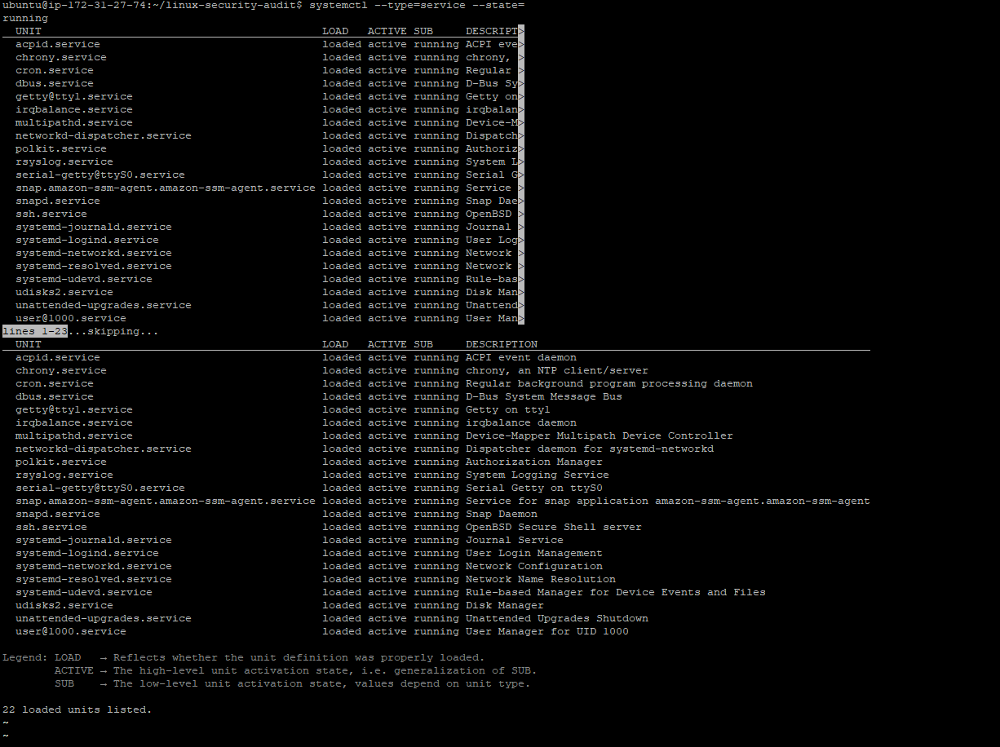
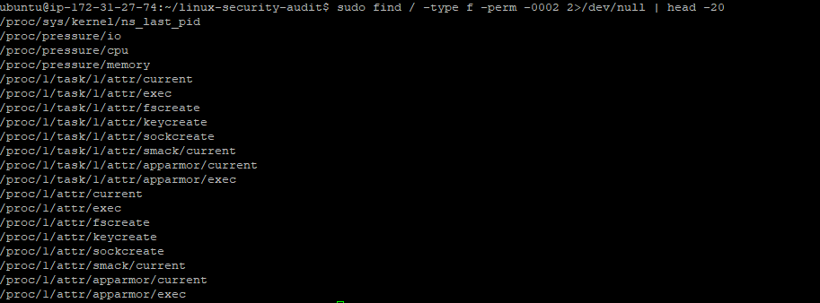

## Linux Security Audit on AWS EC2 (Ubuntu 22.04)

## Project Overview
This project documents the security auditing and hardening of a cloud-hosted Ubuntu 22.04 server deployed on AWS EC2. The objective was to implement foundational Linux security controls and document findings in a structured audit format.

## Environment
- AWS EC2 (Free Tier)
- Ubuntu Server 22.04 LTS
- SSH access via PuTTY (Windows)
- Host-based firewall: UFW

## Security Controls Implemented

### Network Layer (AWS Security Group)
- SSH restricted to a single trusted IP address (/32 CIDR)
- No public HTTP/HTTPS exposure

### Host Firewall
- UFW enabled
- Only OpenSSH allowed

### SSH Hardening
- Root login disabled
- Password authentication disabled
- Public key authentication enforced

### Privilege Audit
- Only one sudo-enabled account
- Root account locked

### Service Enumeration
- Verified minimal running services
- No unnecessary web/database services installed

### File Permission Audit
- No unsafe world-writable files detected (excluding virtual /proc filesystem)

### Patch Management
- System updated
- Unattended security upgrades enabled

## Tools & Commands Used
- `ss`
- `ufw`
- `systemctl`
- `grep`
- `find`
- `/etc/ssh/sshd_config` review

---

## Audit Evidence

### Open Ports

### Firewall Status

### SSH Configuration

### Sudo Group

### Root Account Status

### Running Services

### World Writable File Scan

## Outcome
The server was successfully hardened following cloud security best practices and documented in a structured audit report suitable for cybersecurity portfolio presentation.
